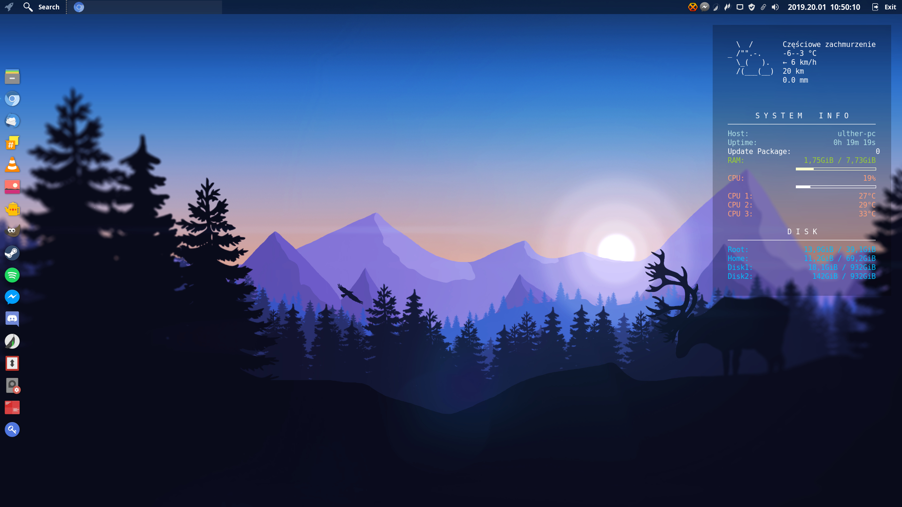
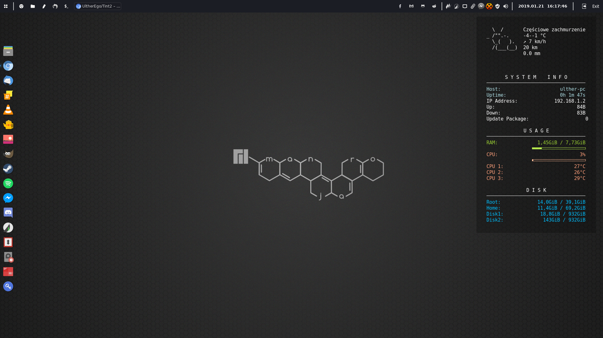

## Tint2

**Popside**:

  

**Trapar**:

  

**Launchy**:

  

**Copy**: 

$>>> cp -r popside-red.tint2rc trapar-top.tint2rc launchy.tint2rc icons/ ~/.config/conky

# Icon Theme:

Papirus Dark with Breeze actions

# Theme:

Matcha-dark-azul

# Wallpapers Catalog:

My favorite Wallpapers
