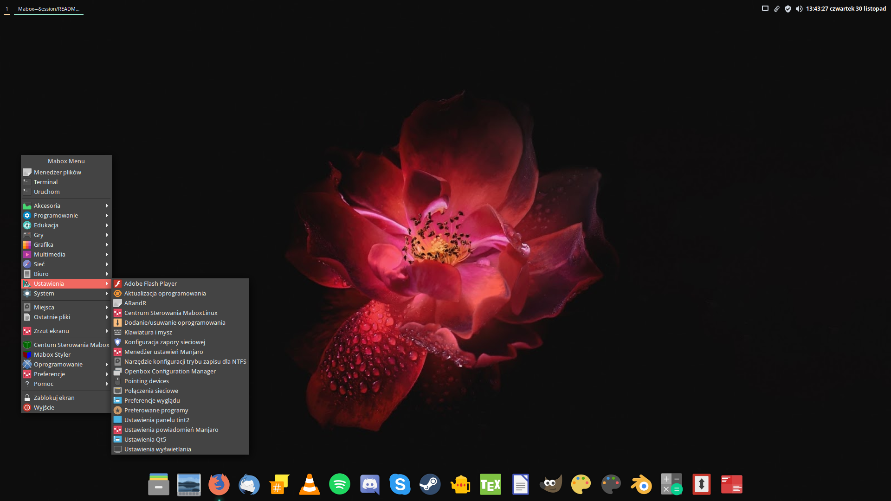

# Mabox---Session

  

# X terminal config: 

~/.bashrc ~/.Xresources

# Openbox theme: 

Numix

# GTK theme: 

Vertex-Maia-Dark

# Tint2:

~/.config/tint2/tint2rc

# Wallpaper:

Set wallpaper.jpg in Nitrogen.

# Plank:

sudo pacman -S plank

and add in ~/.config/openbox/autostart the line:

`## Plank`
`(sleep 1s && plank) &`

# Icon Theme:

Papirus Dark with Breeze actions

Add and set in obconf

